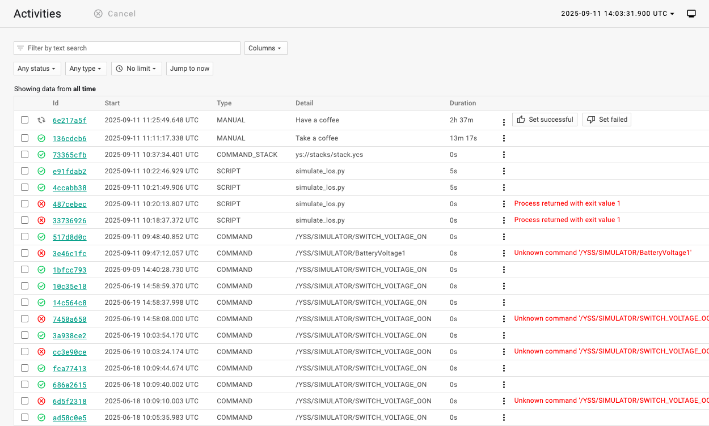
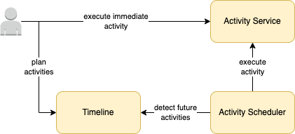

Activities
==========

Yamcs can run background activities whose execution state are tracked in the UI.

Yamcs includes a core set of activity types that cover command execution, stack execution, script execution and manual execution. Yamcs plugins may add more types.

.. note::
    Prior to Yamcs 5.13.0, activities were only available by enabling the :doc:`Timeline Service <../services/instance/timeline-service>`. Since then, activities were upgraded to a core Yamcs functionality, and so no longer require presence of the Timeline Service.

.. rubric:: Status

An activity can assume one of these statuses:

* **RUNNING:** The activity is ongoing
* **CANCELLED:** The activity was cancelled
* **SUCCESSFUL:** The activity completed successfully
* **FAILED:** An error occurred while running the activity

.. rubric:: Relation to Timeline

When combining with the :doc:`../timeline/index`, you can plan activities for future execution:

Planned activities are submitted via the UI or API to the Timeline (saved as activity *items*). An activity scheduler monitors all activity items in the Timeline, and submits them to the activity service when due, for immediate execution.

.. toctree::
    :maxdepth: 1
    :caption: Table of Contents

    commands
    stacks
    scripts
    manual
