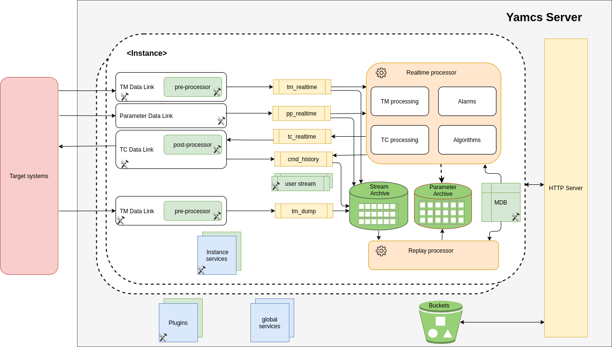

Server Architecture
===================

The Yamcs server runs as a single Java process and it incorporates an embedded HTTP server implemented using `Netty <netty.io>`_.

The main components are depicted in the diagram below.

Instances
---------

The Yamcs instances provide means for one Yamcs server to monitor/control different payloads or satellites or version of the payloads or satellites at the same time.

Most of the components of Yamcs are instance-specific.

Data Links
----------

Data Links are components that connect to the target system (instruments, ground stations, lab equipment, etc). One Yamcs instance will contain multiple data links. There are three types of data received/sent via Data Links:

* Telemetry packets. These are usually binary chunks of data which have to be split into parameters according to the definition into a Mission Database.
* Telecommands. These are usually the reverse of the telemetry packets.
* Parameters. These are historically (:abbr:`ISS (International Space Station)` ground segment) called also processed parameters to indicate they are processed (e.g. calibrated, checked against limits) by another center. 

Connecting via a protocol to a target system means implementing a specific data link for that protocol. In Yamcs there are some built-in Data Links for UDP and TCP. :abbr:`SLE (Space Link Extension)` data links are also implemented in a plugin.

The pre-processors run inside the TM data links and are responsible for doing basic packet processing (e.g. verifying a CRC or checksum) which is not described in the Mission Database.
  
The post-processor runs inside the TC data link and are responsible for doing command processing (e.g. computing a CRC or checksum) which is not described in the Mission Database.

Please note in the picture above that while for telecommands there is a link sending realtime data, for telemetry we also have a data link retrieving dump data - this is data that has been recorded somewhere (on the spacecraft or some other intermediate point) and dumped later. Usually there is no continuous visibility of the spacecraft from the ground and thus most spacecrafts are capable of recording data onboard. The dump data will not be sent to the realtime displays (because the display shows the realtime data coming in parallel) but it will be sent to the archive where it has to be merged with the old data and with the realtime incoming data.

Yamcs does not define the dump data as a special type of data, it is the configuration of which data is sent on which stream and which stream is connected to which processor (see below what streams and processors are) that determines what dump data is.

The CCSDS standards specify a higher level entity called transport frame. Typically the telemetry transfer frames are fixed size and the variable size packets are encoded in the fixed size frames using a well defined procedure. The packets can be multiplexed on the same transmission channel with other types of data such as a video bitstream. The frames allows also multiplexing realtime data with dump data. In order to maintain a constant bitrate required for RF communication, the standards also define the idle data to be sent when no other data is available. 

In Yamcs, all the CCSDS frame processing is performed at the level of Data Links - when frame processing is used, there is a data link that receives the frame (e.g. via :abbr:`SLE (Space Link Extension)`) and then demultiplexes it into multiple sub-links which in turn apply the pre-processor for TM and send the data on the streams to the processors and archive. There is a sub-link (or more) for realtime data and similarly a sub-link (or more) for dump data. Yamcs handles packets and parameters, other type of data (e.g. video) could be sent to external systems for processing and storage.

 
Streams
-------

Streams are components inside Yamcs that transport tuples. They are used to de-couple the producers from the consumers, for example the Data Links from the Processors. The de-coupling allows the user to change the data while being passed from one component to another.

Processors
----------

The Yamcs processor is where most of the monitoring and control functions takes place: packets get transformed into parameters, limits are monitored, alarms are generated, commands are generated and verified, etc. There can be multiple processors in one instance, typically one permanently processing realtime data and other created on demand for replays. 

In particular, the Parameter Archive will create regularly a processor for parameter archive consolidation. This is required in order to process the data received in dump mode (see above) which does not pass through a realtime processor.

Mission Database (MDB)
----------------------

The Mission Database contains the description of the telecommands and telemetry including calibration curves, algorithms, limits, alarms, constraints, command pre and post verification.

Services
--------

A service in Yamcs is a Java class that implements the :javadoc:`org.yamcs.YamcsService` interface. The services can be:

* global meaning they run only once at the level of the server; their definition can be found in :file:`etc/yamcs.yaml`. One such service is the :doc:`../services/global/http-server`.
* instance specific meaning that they run once for each Yamcs instance where they are included; their definition can be found in :file:`etc/yamcs.{instance}.yaml`.
* processor specific meaning they run at the level of the processor; their definition can be found in :file:`etc/processor.yaml`.
 
User can define their own services by adding a jar with an implemented java class into the Yamcs :file:`lib/ext` directory.

Plugins
-------

A plugin in Yamcs is a Java class that implements the :javadoc:`org.yamcs.Plugin` interface. The plugin classes are loaded by the Yamcs server at startup before starting any instance.

Although not required, it is advised that the user creates a plugin with each jar containing mission specific functionality. This will allow to see in the Yamcs web the version of the plugin loaded; the plugin is also the place where the user can register new API endpoints.

Stream Archive
--------------

The Stream Archive is where tuples can be stored. This is a realtime archive, data is inserted as soon as it is received from a stream. It is optimized for storing data sorted by time.

Parameter Archive
-----------------

The Parameter Archive contains values of parameters and is optimized for retrieving the value for a limited set of parameters over longer time intervals. The archive is not realtime but is obtained by creating regular replays transforming data from the stream archive via a processor. Whereas the basic storage unit of the stream archive corresponds to data at one specific time instant (e.g. a telemetry packet, a set of parameters with the same timestamp), the basic storage unit of the parameter archive is a set of values of one parameter over a time interval. 

Buckets
-------

Buckets are used for storing general data objects. For example the CFDP service will store there all the files received from the on-board system. As for most Yamcs components, there is an :apidoc:`HTTP API <buckets>` allowing the user to work with buckets (get, upload, delete objects).

Extension points
----------------

In the diagram above, there are some components that have a build symbol; these is where we expect mission specific functionality to be added:

* new data links have to be implemented if the connection to the target system uses a protocol that is not implemented in Yamcs.
* packet pre-processor and command post-processor are components where the user can implement some specific TM/TC headers, time formats etc. 
* the Mission Database (MDB) contains the description of telecommands and telemetry and is entirely mission specific. 
* user defined streams can implement command routing or basic operations on packets (e.g. extracting CLCW from a TM packet).
* user defined services can add complete new functionality; an example of such functionality is to assemble telemetry packets into files (this is what the CFDP service does, but if the user's system does not use CFDP, a new service can be developed).
* finally plugins can be used to group together all the mission specific functionality.
