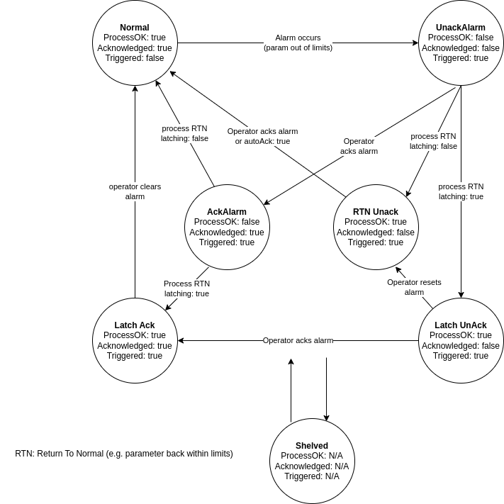

Alarms
======

This section describes the alarm handling in Yamcs.

There are two types of alarms:
 - Parameter Alarms: These are triggered when a monitored parameter goes out of limits (as defined in the MDB).
 - Event Alarms: These are raised for events that have severity other than INFO.

Both types of alarms can be enabled/disabled in `processor.yaml` 

**Alarm States**

Alarms in Yamcs follow a lifecycle inspired from the standard ISA-18.2 ("Management of Alarm Systems for the Process Industries").
The figure below presents a state diagram for the alarm handling process:

The "Process" in the diagram refers to the state of the Parameter or the Event.
 - for Parameters, ProcessOK means that the latest known value of the parameter is wihitn limits or that the monitoring has been disabled.
 - for Events, ProcessOK means that an event with the same (source, type) and severity INFO has been received.

`RTN` means Return to Normal.

** Latching and Auto-acknowlegment
- Latching Alarms require an explicit action from the operator to clear, even if the alarm has been acknowledged and the parameter returns to normal. 
- Auto-acknowlegment means that the alarm clears itself as soon as the parameter returns to normal.

Currently all alarms in Yamcs have these flags disabled, meaning that an alarm clears if the operator has acknowledged it and the parameter returned to normal.
Allowing configuring these flags probably require extending the XTCE MDB and may be done in the future (if interest from users exists). 

