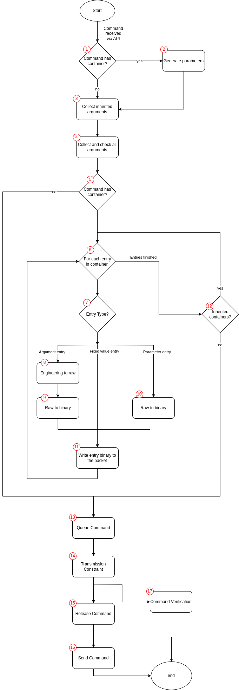

Command Processing
====================

This section provides a detailed description of how Yamcs processes commands based on MDB definitions, following a series of steps as outlined in the diagram below.

The figure below provides an overview of the steps involved, followed by a more detailed description of each step.

**1. Command has container?**
When a command is received via API, the first step is to determine whether the command includes a container. The `allowContainerlessCommands` processor option is required for the command to be allowed without a container. 

If the command has a container, proceed to step 2, where the parameters used for container inheritance are generated.

**2. Generate parameters**

XTCE defines two methods for command inheritance conditions: using parameter conditions (this step) and argument assignments (step 3). P

Parameter inheritance resembles telemetry, where conditions are based on parameter comparisons, allowing only equality conditions (as opposed to more general boolean conditions in TM inheritance).

An example can be seen in the `CCSDS green book <https://github.com/yamcs/yamcs/blob/master/yamcs-core/src/test/resources/xtce/ccsds-green-book.xml>`__

Note that only equality conditions are allowed (whereas in TM inheritance general boolean conditions may be used).

Yamcs will generate some parameter values according to the inheritance condition. The parameters may be used later in building the binary packet. Note that other than in the command building the value of these parameters are not published anywhere. The parameter generated are with both raw and engineering value.

**3. Collect inherited arguments**

The next step is to collect the arguments from all the ArgumentAssignments part of the inheritance conditions. This is similar with step 2.

**4. Collect and check all arguments**

In this step, all arguments — whether received from the user (via the API), inherited or from the default values — are gathered. All arguments are checked for validity. The value that is collected is the engineering value. The conversion to raw value will be performed only if the command has a container in step 8 below.

**5. Command has container?**

If the command has a container associated, the process moves to step 6, where the binary packet starts to being built. If not, the process skips directly to step 13 for verification.

**6. For each entry in container**

For commands with containers, each entry within the container is processed and inserted into the binary packet. The processing starts from the root container.
The type of entry determines the next steps in the flow.

**7. Entry Type**

Here, the type of entry within the container is determined:

If the entry is an argument, the flow continues to step 8, where the argument is converted from engineering units to raw values.
If the entry has a fixed value, the process moves to step 11, where the fixed value binary is written to the packet. The fixed values are specified in binary, they do not need conversion.
If the entry is a parameter, the flow proceeds to step 10 to convert the parameter to binary.

**8. Engineering to raw**

For argument entries, the first step is to convert the engineering value to raw value. This may involve a calibration step.

**9. Argument Raw to binary**

The raw value is converted to a binary value according to the data encoding, possibly using an algorithm.

**10. Parameter Raw to binary**

Similarly, for parameter entries, the raw values are converted into binary format according to their data encoding. The parameter values used here are in priority those generated at step 2, or collected from the current values in the processor (from incoming TM). If no value is found for a parameter, an exception is thrown and the command processing stops.  

**11.  Write entry binary to the packet**

The converted binary values are written into the binary packet according to their absolute or relative position.

**12.  Inherited containers**

The steps 6-11 are repeated by traversing down the tree from the root container to the container associated to the command sent by the user, converting and inserting all entries.

At this stage the command is built, ready to be sent. Yamcs will perform a few permissions checks: users with the `CommandOptions` system privilege are allowed to add different attributes to the command as well as disable transmission constraints and verifiers. Other users attempting to do that will be rejected. 

The API allows to issue a command with an option `dry_run=True`, case in which the processing will stop here and the prepared command including the binary and the collected argument values will be returned to the API user.

**13. Queue Command**

At this step the command is inserted into the command queue and also into the Command History (this is the 'Q' ack in the command history). The queue where the command is inserted is determined by probing all the configures queues in order for these criteria:
- is the user allowed to enter commands in that queue
- is the command significance level appropriate for the queue
- is the command qualified name matching the patterns specified by the queue. This condition will satisfy if the queue has no pattern.

If no queue matches the criteria, the last default queue will be used. Depending on the state of the selected queue, the following will happen:

- If the selected queue is in state `DISABLED`, the command processing is immediately terminated.
- If the selected queue is in state `BLOCKED`, the command processing is suspended waiting for the queue to be enabled (or disabled and then the processing is terminated).
- If the selected queue is in state `ENABLED`, then the processing continues with the next step.

**14.  Transmission Constraints check**

If the command has transmission constraints (and have not been disabled in the API request), the constrains will be checked possibly waiting a configured interval. The constraints typically involve checking some telemetry parameters. If no delay has been specified, the current value of the parameters are received from the processor cache and if the check fails, the command is failed. If the delay has been specified in the transmission constraint, the parameter is checked (if found in the cache) and if the check fails, a subscription will be created to the incoming parameters.

If a successful check can be performed in the configured delay interval for all the constraints, then the command is released from the queue.

Just before releasing the command from the queue, if the command has verifiers (and the verifiers have not been disabled in the API request), the verifiers are started. 

**15. Release Command**

This step usually involves releasing the command into a stream (it corresponds to the 'R' ack in the command history). Note that the command releaser could be changed by the user in the processor.yaml. Here we describe what the default StreamTcCommandReleaser does. 

There maybe multiple streams where the command can be released. The instance configuration contains a list of TC streams (in the `streamConfig` section) each stream with a list of TC patterns specified. In addition, the user may specify via the API a particular stream where the command should be released. The streams are checked in order and the first stream that satisfies both conditions will be used.

Finally, some services may insert themselves in the release list in front of the regular streams configured in the instance configuration. For example the Yamcs Gateway will do that to ensure that certain commands that it declare reach the nodes. Generally any component in Yamcs may define a command in MDB and add itself in the release list to make sure it receives that command.

**16. Send Command**

If the command has been released into one of the regular streams, it ends up with the Link Manager. The Link Manager is the component that controls all the links declared in the instance configuration. Based on the `tcStream` property of each link, it has for each stream an ordered (the order is given by the link configuration) list of links that can send command from that stream.

Once the Link Manager receives the command on a stream, it sequentially considers the *enabled* links associated with that stream. It attempts to send the command on each link in the order specified by the link configuration. Each link can either:

1. decline sending the command passing it to the next link.
2. attempt to send the command and in this case the Link Manager will not attempt to use another link.

If all the links have declined the offer to send the command (or were disabled), the Link Manager will fail the command with the error "no link available".

Once a link has accepted to send the command, it is responsible to update the command hisotry with the Sent ('S') ack. If it failed to send the command it is also responsible for completing the command with failure.

**17. Command Verification**

As mentioned above, before the command has been released from the stream, all the verifiers are started. The command verifiers usually check for certain conditions in telemetry and populate the command history accordingly. Each verifier can at any time declare the command completion (either successfully or with failure) case in which all other running verifiers are immediately aborted. Similarly, the verifiers monitor the command history for command completion events generated by other sources (for example the link failing the command if it cannot send it) and they immediately abort in case the command has bene completed.

Note that Yamcs does not enforce strict handling of command completion. For example, while a verifier may declare a command as failed, another component (such as a link) can later mark the same command as successful, updating the specific attribute in the Command History (which is a table in the database).
