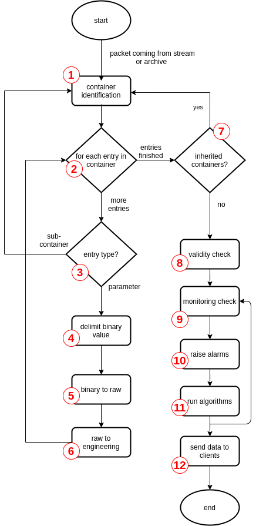

TM Packet Processing
====================

This section describes how Yamcs processes the TM packets according to the MDB definitions.
Note that when Yamcs receives a packet, it sends it first to a :doc:`../links/packet-preprocessor` which assigns it a generation time. The generation time is saved in the archive and also used as generation time for all parameters extracted from that packet.

The figure below provides an overview of the steps involved, followed by a more detailed description of each step.

**1. Container identification**

When Yamcs has to process a TM packet it has first to know which MDB container it corresponds to.
For realtime packets this is done based on the stream on which the packet is coming. Each stream has an attribute ``rootContainer`` (defined in ``streamConfig -> tm`` in :file:`etc/yamcs.{instance}.yaml`) which configures the container used for all packets coming on that stream.
For historical reasons that attribute is optional; if not configured Yamcs will take the first container (when traversing the MDB tree) having no parent.
For archive packets, that information is stored in the archive the first time the packet is received.

The processing returns to this step when processing sub-containers or inherited containers (see below).
   
**2. Entry selection**

Once a packet is matched to a container, Yamcs can proceed to extract the container entries. There are cases when, in order to improve the performance, Yamcs performs a partial retrieval - only a subset of the entries are processed. 

This for example is done as part of the XtceTmRecorder service when Yamcs does not want to extract parameters but only to identify the packet to its lowest sub-container; it is also done when performing a reply for the purpose of extracting a parameter or a set of parameters.
The property that configures this behavior is ``config -> subscribeAll`` in the processor configuration in :file:`etc/processor.yaml`. If the property is set to false, then only the parameter subscribed (and the dependent parameters) will be extracted.

**3. Entry processing**

A container has different types of entries: 

- parameters - for these the processing continues with the steps 3-6 below. 
- sub-containers - a new container processing context (bit offset starting from 0!) is created and the processing continues from step 1.
- array parameters (not shown in the figure) - these have their size either preset in the MDB or given by another parameter which has already been extracted from the packet. Yamcs will loop and extract the necessary number of array elements according to their data types in the steps 3-6 below. Note that there cannot be gaps between the elements of the array.
- aggregate parameters (not shown in the figure) - are parameters containing multiple members (like a struct in C). For each member of the aggregate Yamcs will extract the aggregate member according to its data type. As for the array elements, there can be no gap between aggregate members.
- indirect parameters (not shown in the figure) - are placeholders for other parameters - the exact parameter that will be extracted is determined by the value of another parameter proceeding it in the packet. Typically there is an id followed by some data, the data represents one parameter value and the id tells which parameter exactly the data represents.

For each entry, the MDB defines the position (in bits) in the packet of the start of the entry. This can be specified either absolute from the beginning of the packet or relative to the previous entry. Note that XTCE allows positions relative to the end of the packet but this is not supported by Yamcs.

**4. Binary value delimitation**

The start of the parameter in the packet is given by the offset in the container entry definition as explained above. The size in bits is given by the *Data Encoding* (or element/member Data Encoding for the arrays/aggregates). Some data encodings can be fixed in size (e.g. a 32 bit floating point number or a 4 bits integer), some of them can be variable size - typical examples are strings or binary. Finally there can be an user defined algorithm which can determine the size and also extract the raw value as explained below. The data decoding algorithms have to be implemented in Java (Javascript and Python are not supported)

**5. Binary to raw value**

Part of the data type processing is also extracting the raw value from the packet. The raw value is one of the usual types: boolean, signed/unsigned integer (max 64 bits), float (32 or 64 bits), string, binary, array or aggregate. Note that the binary type is an array of bytes but it is not an array parameter type. Using a binary parameter types instead of an array of 8 bit integers is more efficient and thus preferred in most cases.

**6. Raw to engineering value**

Next step in the processing is the conversion of the raw value to the engineering value. This is done using the calibration rule (if any) part of the **Parameter Type** MDB definition. A special case is an enumerated parameter type - the engineering value of such parameter is a special type called EnumeratedValue which has a dual integer/string representation. Other special type is an absolute time - the engineering value is a timestamp (resolution is millisecond). 

After the engineering value has been computed, Yamcs defers further processing until all entries have been extracted.

**7. Container inheritance**

After all entries from one container have been extracted, Yamcs proceeds to check if there is any inherited container which matches the condition. If there is, the container is processed starting with step 1.

Note that the bit offset is not re-initialized to 0 as for sub-containers. It is considered that the inherited container contains the entries of the parent (already extracted) and thus any absolute position is counted from the beginning of the original packet. 

**8. Validity check**

After all entries from the root container and all inherited containers to the deepest level have been extracted, Yamcs proceeds to perform checks on the extracted parameters. The first is checking against the validity range (if any) - if the check fails the parameter is declared as invalid and monitoring limits in the next step are not checked (no alarm raised either). If a parameter is invalid, it usually means that something went wrong with the transmission of the data.

**9. Monitoring check**

If a parameter has passed the validity checks, the monitoring checks are performed. This means checking a numeric parameter as being inside certain limits or checking an enumerated parameter having certain values. There is no monitoring check for boolean, string, binary, aggregate or array parameters. The monitoring checks can use contextual information - that means the limits checked depend on other parameters. The monitoring checks can be disabled by setting ``config -> alarm -> parameterCheck`` to false in :file:`etc/processor.yaml`.

**10. Alarm raising**

If the alarm server is enabled (``config -> alarm -> parameterServer`` in :file:`etc/processor.yaml`), alarm will be raised for all parameters which are determined by the previous step to be out of limits.

**11. Algorithms**

If there is any algorithm taking as input one of the parameters extracted, the value is provided to the algorithm. Depending on the algorithm definition, the algorithm is also run possibly producing more parameters. These parameters are also passed through the monitoring checks and alarms in step 9 and 10 (if they have defined limits).

**12. Data distribution**

Finally the list of all parameter values (those extracted from packet and those computed by algorithms) are distributed to all clients (displays, yamcs-web, etc).
