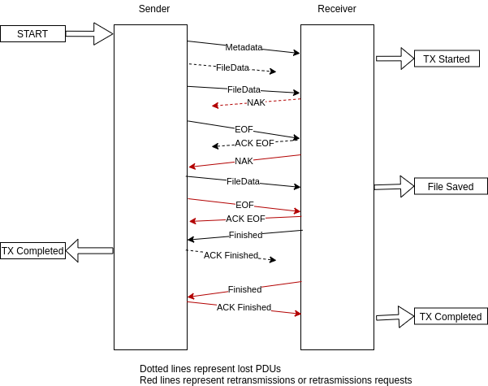

.. _cfdp-service:

CCSDS File Delivery Protocol (CFDP)
===================================

This service implements the CCSDS File Delivery Protocol class 1 (unreliable transfer also called unacknowledged ) and class 2 (reliable transfer also called acknowledged).

Class 3 and 4 (transfers via one or more waypoints) are not supported.

The service uploads and downloads files between a spacecraft (or a remote device) and a Yamcs bucket. In the description below, the entity that sends the file is called the Sender and the entity that receives the file is called the Receiver.

The protocol specification can be found in  `CCSDS 727.0-B-5 <https://public.ccsds.org/Pubs/727x0b5.pdf>`_ The following description summarizes the specs and provide details on the parts implemented/not implemented by this service.

The upload/download works by splitting the file into segments and uploading/downloading each segment individually (usually embedded as part of a TC/TM packet). The transmission is preceded by a metadata PDU (Protocol Data Unit) and finished with an EOF PDU. The Receiver will send the Finished PDU to let the Sender know that all PDUs have been received.

The class 1 (unreliable transfer) will upload/download all the segments without the possibility of retransmission. The EOF is not acknowledged by the Receiver. The Issue 5 of the CFDP standard introduces an option "Closure Requested" which requests the class 1 Receiver to send a Finished PDU upon receiving all the data (or when the canceling the transfer).  The Finished PDU is not acknowledged by the Sender. This option is useful when the underlying communication protocol is reliable.   

For class 2 (reliable transfer) transfers, the Receiver can indicate missing metadata or data by sending NAK PDUs. In this mode, the Receiver has to acknowledge the EOF PDU and the Sender has to acknowledge the Finished PDU. Sending a PDU that requires acknowledgment will start a timer. When the timer expires, if the acknowledgment has not been received, the PDU is resent and this is done until a count reaches a maximum defined value. Finally if the count has reached its maximum value and the acknowledgment has still not been received, a fault condition is triggered which may cause the transfer to be abandoned, canceled or suspended.

A diagram of the operations for class 2 is presented in the figure below. Note that the Receiver operates in immediate NAK mode; it sends a NAK as soon as it receives the FileData PDU (containing a file segment) and detects a missing segment.

Note also that the file is available on the Receiver before the transfer is completed by the reception of the Finished ACK PDU.

The CFDP transfers can be suspended and resumed. Suspending means that no PDU is sent out but incoming PDUs are still processed. The timers are deactivated. Upon resuming, the timers are restarted and their counts reset to 0. For example if at the time of the suspension, an EOF has been sent 2 times out of 5, after the transfer is resumed, the EOF sending is again starting with 0 out of 5. This allows suspending the transfer when the limit has been reached and resume the transfer at a later moment without changing the state.

Several peculiarities and limitations of the implementation can be noted:

* The NAK PDUs issued by the Sender always contain the beginning of the file up to filling up the PDU with data. Unless the file is very large and with lots of small gaps, a NAK PDU will contain all the missing data at the given point.
* The Receiver will overwrite the list of segments to resend with the list received in the latest NAK.
* Keep Alive PDU and Prompt PDU are not used.
* Filestore requests are not supported.
* Only proxy put requests and directory listing requests are supported, other user operations (proxy, remote status, etc.) as per chapter 6 of the CCSDS 727.0-B-5 are not supported.
* Remote suspend/resume operations are not supported. Note that local suspend/resume operations are supported; this means that suspending a transfer has to be done concurrently on this service and remotely with a different mechanism (e.g. sending a telecommand).

Usage
-----
The service produces PDUs as per CCSDS specification. The PDUs are written/read to/from Yamcs streams. How the PDUs are sent to/from the spacecraft is mission specific.

An example on how to use the streams to embed the CFDP PDUs into CCSDS packets can be seen in the cfdp example (the most interesting part is in :file:`src/main/yamcs/etc/extra_streams.sql`).

Class Name
----------

:javadoc:`org.yamcs.cfdp.CfdpService`

Configuration
-------------

This service is defined in :file:`etc/yamcs.{instance}.yaml`. Example:

.. code-block:: yaml

  services:
     - class: org.yamcs.cfdp.CfdpService
       name: cfdp0
       args:
           sequenceNrLength: 4
           maxPduSize: 512
           incomingBucket: "cfdpDown"
           eofAckTimeout: 3000
           eofAckLimit: 3
           sleepBetweenPdus: 1000
           localEntities:
             - name: id1
               id: 11
               bucket: bucket1
             - name: id2
               id: 12
           remoteEntities:
             - name: target1
               id: 5
             - name: target2
               id: 7
               bucket: bucket3
           senderFaultHandlers:
             AckLimitReached: suspend
           receiverFaultHandlers:
             AckLimitReached: suspend
            

              
Configuration Options
---------------------

name
    The name of the service - used in the API calls. If multiple CfdpServices are used, this has to contain a different value for each service. By default it is "CfdpService".
    
inStream (string)
    The name of the stream where the CFDP PDUs are read from. Default: ``cfdp_in``
    
outStream (string)
    The name of the stream where the CFDP PDUs are written. Default: ``cfdp_out``
  
incomingBucket (string)
    The name of the bucket where the CFDP incoming files are saved if no specific ones are defined per local or remote entity. Default: ``cfdpDown``

allowRemoteProvidedBucket (boolean)
    Enable setting the bucket for incoming remote files with the ``bucketName:filename`` syntax for the received object name. Default: ``false``

allowRemoteProvidedSubdirectory (boolean)
    Enable subdirectory comprehension from incoming remote object names containing directory delimiters. **Be wary of directory traversal depending on the bucket type**, FileSystemBucket should be safe. Default: ``false``

allowDownloadOverwrites (boolean)
    Permit overwriting incoming files if their names match. If false, will append an incremented number (up to ``maxExistingFileRenames``) to the received file name. Default: ``false``

maxExistingFileRenames (integer)
    Maximum number appended to incoming file names in case of matching names (when ``allowDownloadOverwrites`` is false). Default: ``1000``

localEntities (map)
    A list of entity definitions used to give names to the local (Yamcs) entity identifiers as well as to configure which bucket is used for storing the files received for that entity. The names can be used in the API calls when initiating transfers. The list has to contain all identifiers which will be used by the remote system to send files.  If a PDU is received to an identifier not in this map, the PDU will be dropped and no transaction will be started.

    The ``bucket`` is optional; if missing, the file will be saved into the bucket specified for the remote entity and if that is missing too in the general bucket configured with the ``incomingBucket``.
    
remoteEntities (map)
    A list of entity definitions used to give names to the remote (spacecraft) entity identifiers. The names can be used in the API call when initiating transfers.

    The list has to contain all identifiers which will be used by the remote system to send files. If a PDU is received from an identifier not in this map, the PDU will be dropped and no transaction will be started.
    The list can contain also a bucket name used if the matching local entity does not define a bucket. In the example above if a file is downlinked having source (spacecraft) id = 7 and destination (Yamcs) id = 12, it will end up in bucket3.

entityIdLength (integer)
    The length in bytes of the entity id for the outgoing CFDP transfers. The entity id and the sequence number represent the CFDP transaction identifier. It is encoded in the header of all the CFDP PDUs. These lengths together with the sequenceNrLength determine the size of the PDU header:    
    
    ``PDU_header_size(bytes) = 4 + 2 * entityIdLength + sequenceNrLength``
    
    For the incoming transfers the remote peer specifies the lengths. Default: ``2``
     
sequenceNrLength (integer)
    The length in bytes of the sequence number for the outgoing CFDP transfers. Default: ``4``
    
maxPduSize (integer)
    The maximum length in bytes of the PDU is used by the sender to determine how to split the file into segments (segment size = PDU size - header size). For the incoming transfers the peer specifies the PDU size. Default ``512``

sleepBetweenPdus (integer)
    The time in milliseconds used by the sender to wait in between sending two successive PDUs. This together with the PDU determine the uplink data rate. The data rate has to match the maximum uplink speed as well as the receiver expected data rate. No mechanism is implemented for auto-tuning the uplink rate. 

canChangePduSize (boolean)
    Whether a ``FileTransferOption`` can be used to set a specific transfer's PDU size. Default: ``false``

pduSizePredefinedValues (list)
    List of predefined integer values for the PDU size option when ``canChangePduSize`` is ``true``, shown as a dropdown menu in the web UI.

canChangePduDelay (boolean)
    Whether a ``FileTransferOption`` can be used to set a specific transfer's PDU delay (sleep between PDUs). Default: ``false``

pduDelayPredefinedValues (list)
    List of predefined integer values for the PDU delay option when ``canChangePduDelay`` is ``true``, shown as a dropdown menu in the web UI.

inactivityTimeout (integer)
    The time in milliseconds used by both the sender and receiver to check for inactivity. The timer is active on the receiver until EOF has been received and on class 2 sender after EOF has been sent (while waiting for the Finished PDU). If the timer expires, the InactivityDetected event will be triggered and the transaction may be cancelled or suspended (depending on the configuration of the fault handler for InactivityDetected event).

    Default: ``10000`` (10 seconds).

eofAckTimeout (integer) 
    Valid for class 2 transfers; the time in milliseconds used by the sender to wait for the EOF PDU acknowledgment. The sender sends the EOF PDU to indicate that it has completed transmitting the file. It expects to receive an acknowledgement indicating the reception of the EOF PDU (not of the file!, the Finished PDU is used for that). The EOF PDU is retransmitted if no acknowledgment has been received in this time.

    Default: ``3000`` (3 seconds).

eofAckLimit (integer)
    Valid for class 2 transfers; the number of times to retry sending the EOF PDU before declaring a fault. Zero means that only one PDU will be sent (no retry). Negative value means no limit. Default: ``5``.

finAckTimeout (integer)
    The time in milliseconds used by the receiver to wait for the FIN PDU acknowledgment. The receiver sends the Finished PDU to indicate that the file has been received or that a fault has been encountered. The receiver expects the sender to acknowledge reception of this PDU and will retransmit the PDU if no acknowledgment has been received in this time.

    Default: ``10000`` (10 seconds)

finAckLimit (integer)
     The number of times to retry sending the Finished PDU before declaring a fault. Zero means that only one PDU will be sent (no retry). Negative value means no limit. Default: ``5``.

immediateNak (boolean)
     Valid for class 2 transfers; if true, the receiver will send NAK PDUs as soon as a missing segment is detected. The NAK PDU contains the list of segments that are missing at the receiver side. If the EOF PDU has not been received, the NAK PDU covers only the segments missing up to the last one received.

     If this parameter is false, the receiver will only send NAK PDUs after the EOF PDU has been received. In this case the NAK PDU will contain all the missing segments. Default: ``true``

nakTimeout (integer)
   Valid for class 2 transfers; used by the receiver as the time interval between two successive NAK PDUs, assuming the data has not been recovered.

   Default: ``5000``

nakLimit (integer)
    Valid for class 2 transfers; the number of times to send a NAK PDU with no data recovered before declaring a fault. A value of 1 means that one NAK is sent and if no data is recovered within the nakTimeout milliseconds, a fault will be declared. Zero or negative value means no limit. 

    Default: ``-1``
 

senderFaultHandlers (map)
    A definition of the actions to be taken when the sender encounters different faults. The definitions are in the form of ``conditionCode -> action`` map.
    
    The possible condition codes are: ``AckLimitReached``, ``KeepAliveLimitReached``, ``InvalidTransmissionMode``, ``FilestoreRejection``, ``FileChecksumFailure``, ``FileSizeError``, ``NakLimitReached``, ``InactivityDetected``, ``InvalidFileStructure``, ``CheckLimitReached`` and ``UnsupportedChecksum``.

    The possible actions are: ``suspend``, ``cancel`` or ``abandon``. Suspend means the transfer will be suspended and can be resumed later (for example an ack limit reached may be caused by the lost of communication with the spacecraft and the transfer can be resumed when the communication is established again). Cancel means that the remote peer is notified that the transaction is canceled. Abandon means to abort the transaction without notifying the peer.

    Note that the error can be generated locally or received from the peer in a FIN PDU.

receiverFaultHandlers (map)
    Similar with ``senderFaultHandlers`` but applies when the service works as Receiver (i.e. for downlinks). 

maxNumPendingDownloads (integer)
    The maximum number of allowed concurrent downloads. If this limit is reached, any PDU that would start a new download is dropped and an event message generated. Default: ``100``

maxNumPendingUploads (integer)
    The maximum number of allowed concurrent uploads (including download requests and directory listing requests). If this limit is reached, the new uploads are queued. Default: ``10``

directoryTerminators (list)
    When starting an upload to a directory (folder), the CFDP service will append the object name to the directory name. To know if the destination is a folder (and not a file), the end character is compared with the terminators in this list.

    This is also being used for the directory listing parsing if not specified in its options. Default: ``["/", ":", "\\"]``

hasDownloadCapability (boolean)
    Whether this CFDP service is able to download remote files. Default: ``true``

hasFileListingCapability (boolean)
    Whether this CFDP service is able to request a file list of a remote directory. Default: ``true``

fileListingServiceClassName (string)
    Class of the directory listing service to use (see :ref:`File listing service <file-listing>`) to retrieve file lists.
    Default: ``org.yamcs.cfdp.CfdpService`` (i.e. ``this`` very instance of the service).

fileListingServiceArgs (map)
    Arguments to the FileListingService used (depends on implementation).

automaticDirectoryListingReloads (boolean)
    Whether the CFDP Service should automatically try to send a directory listing request when a client fetches a file listing. Default: ``false``

fileListingParserClassName (string)
    Class for parsing the CFDP directory listing response files. Default: ``org.yamcs.filetransfer.BasicListingParser``

fileListingParserArgs (map)
    Arguments for the FileListingParser used (depends on implementation).

allowConcurrentFileOverwrites (boolean)
    If this option is true, when starting an upload, the CFDP service verifies if an upload with the same destination filename is ongoing or queued and will raise an error. This is done in order to avoid overwriting the same destination file in case multiple files are uploaded from the yamcs-web. Default: ``true``

pendingAfterCompletion (integer)
    Number of milliseconds to keep the incoming transaction in memory after completion. During this time, the newly received EOF PDUs belonging to the transaction are still answered. All the other PDUs belonging to the transaction are ignored. Default: ``600000`` (10 minutes).
    Consequentially if a new transfer would start with the same id (for example following an on-board computer reboot), the transfer will not be recognized as new before this timer has expired.

checksumType (string)
    The checksum type to use for outgoing transfers. Supported values are ``NULL`` and ``MODULAR``.
    The checksum type for incoming transfers is read from the Metadata PDU, but only these two values are supported, anything else will cause the transfer to fail with the ``UNSUPPORTED_CHECKSUM_TYPE`` condition code.

    Note: ``NULL`` is a special value in YAML, so you must enclose it in quotes when using it.

    Default: ``MODULAR``