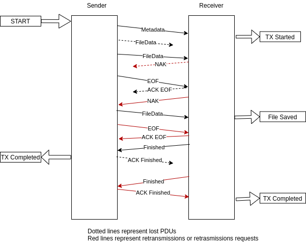

This service implements parameter retrieval. It stands behind the "/parameters" API endpoints.

The service combines retrieval from several sources:
- Parameter Archive - this stores efficiently parameter values for long durations.
  However the parameter archive is built by the back filler in segments and generally a segment cannot be used
  unless the full segment has been built and written to the database.  
- Replays - this means processing a stream of packets for extracting parameters. 
  For parameters not part of packets, a similar process is used, 
  entire rows from the pp table have to be streamed in order to extract the value of the required parameters.
  This process makes the replays more CPU intensive but the advantage is that up to date records can be retrieved.
- Parameter Cache - Yamcs can cache in memory the most recently received values of some parameters. However, as this consumes RAM,
  the number of samples which can be cached is limited.
- realtime Parameter Archive filler - in certain cases when it is guaranteed that only new data is received (common case during 
  lab/flatsat/EGSE tests), the realtime filler can be used instead of the back filler. 
  The realtime filler works as a parameter cache as well (so it can return values from the segments that are being built),
  so the Parameter Cache is not required in this scenario.

The diagram below presents the case when the realtime Parameter Archive Filler is not used.

