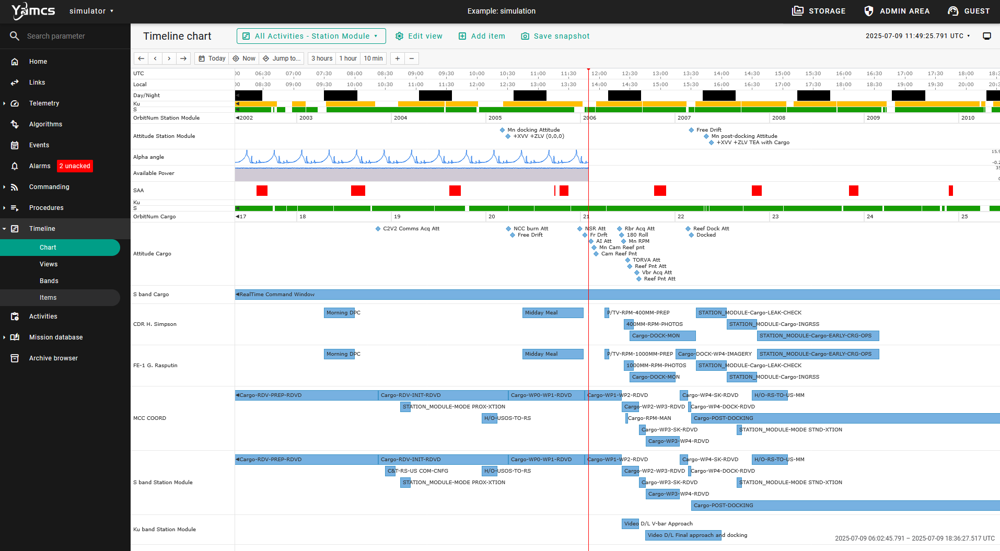

Timeline
========

Yamcs includes an instance-level timeline service for rendering content on a visual, chronological time scale. The service can be used either through UI or API. In the latter case it can be integrated with other software, for example to visualize the result of mission-specific planning software.

Items on the timeline can show arbitrary content, or they could map to Yamcs activities.

To enable this service, see the :doc:`configuration reference <../services/instance/timeline-service>`.

.. rubric:: Example

The following screen capture shows a view with different bands:

* Two time rulers in different time zones
* Day/Night, Comms, Attitude, SAA
* Inline parameter plots
* Multiple bands showing information of high-level planned activities (not Yamcs activities)

Bands (or individual items) have many configuration options so that different types of presentations can be achieved.

.. toctree::
    :maxdepth: 2
    :caption: Table of Contents

    model
    bands/index
    events
    tasks
    activities
    dependencies
