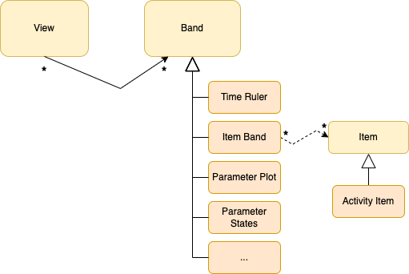

Model
=====

* **Views** are composed of horizontal bands. A band may be used in any number of views, it is not owned by the view.
* **Bands** are horizontal lanes showing different types of content. Typically you would include at least a *Time Ruler* band. *Item Band* is a general purpose band which can render *items*. The items that a band should render can be filtered through the use of tags. Other band types include the ability to render parameter plots or value changes.
* **Items** have a start and a duration. Items can be associated with a set of tags. Any *Item Band* with the same tags, will show such items. 

  .. note::
     Other systems often use the term *events* instead of *items*, however because this term already means something different in Yamcs, we use the term *items* instead.
* **Activity Items** are a special kind of item. They contain the definition of a Yamcs activity, and are picked up by the :doc:`activity scheduler <scheduling>` for automated execution.
